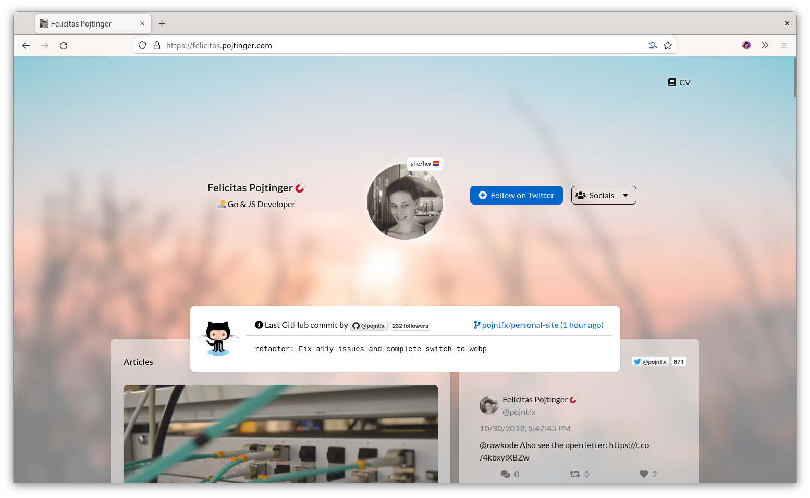
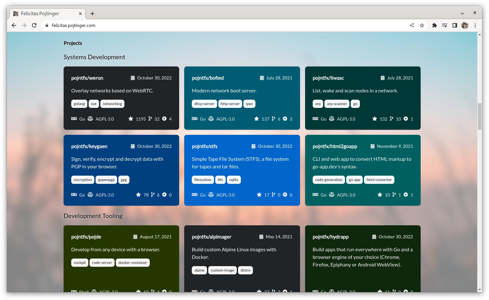
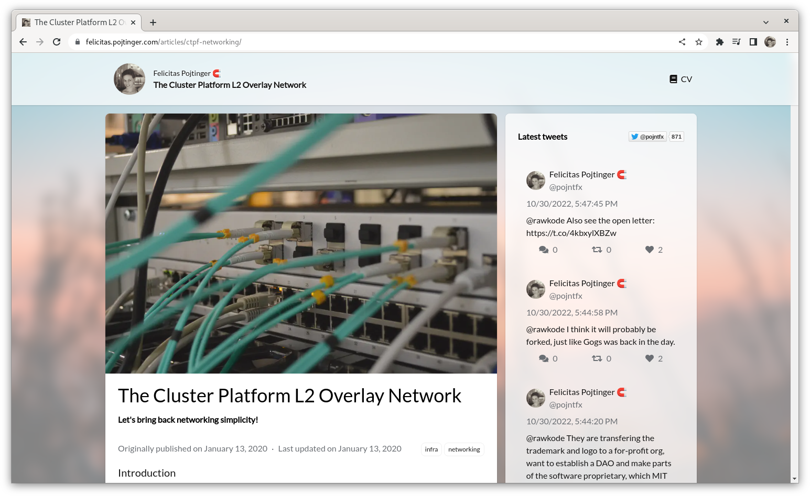

# Personal Site

My personal site.

[](https://github.com/pojntfx/personal-site/actions/workflows/hydrun.yaml)

[](https://pkg.go.dev/github.com/pojntfx/personal-site)
[](https://github.com/pojntfx/personal-site/releases)

## Overview

This is my personal website, which is also intended to be a more or less generic template to build more personal websites with.

It provides the following information:

- Personal details (name, profession, pronouns)
- Social media details (Twitter/Mastodon/Instagram, Matrix/Signal, phone/mail)
- Latest GitHub commit
- Livestream (Twitch & YouTube) status
- Articles with comments
- Latest tweets
- Project list (fetched from GitHub)

## Installation

The web app is available on [GitHub releases](https://github.com/pojntfx/personal-site/releases) in the form of a static `.tar.gz` archive; to deploy it, simply upload it to a CDN or copy it to a web server. The release also includes the project list generation tool, API server and proxy. For most users, this shouldn't be necessary though; simply visit the [public deployment](https://felicitas.pojtinger.com/) to access it:

[](https://felicitas.pojtinger.com/)

## Screenshots

Click on an image to see a larger version.

<a display="inline" href="./docs/chrome.png?raw=true">

</a>

<a display="inline" href="./docs/firefox.png?raw=true">

</a>

<a display="inline" href="./docs/webkit.png?raw=true">

</a>

<a display="inline" href="./docs/project-list.png?raw=true">

</a>

<a display="inline" href="./docs/article-list.png?raw=true">

</a>

<a display="inline" href="./docs/article.png?raw=true">

</a>

<a display="inline" href="./docs/comments.png?raw=true">

</a>

## Acknowledgements

- [gohugoio/hugo](https://github.com/gohugoio/hugo) provides the static site generator.
- [dghubble/go-twitter](https://github.com/dghubble/go-twitter) provides the Twitter API library.
- [google/go-github](https://github.com/google/go-github) provides the GitHub API library.
- [nicklaw5/helix](https://github.com/nicklaw5/helix) provides the Twitch API library.
- [googleapis/google-api-go-client](https://github.com/googleapis/google-api-go-client) provides the YouTube API library.
- [giscus/giscus](https://github.com/giscus/giscus) provides the comment system.
- The open source [PatternFly design system](https://www.patternfly.org/v4/) provides the components for the project.

To all the rest of the authors who worked on the dependencies used: **Thanks a lot!**

## Contributing

To contribute, please use the [GitHub flow](https://guides.github.com/introduction/flow/) and follow our [Code of Conduct](./CODE_OF_CONDUCT.md).

To build the site locally, run:

```shell
$ git clone https://github.com/pojntfx/personal-site.git
$ cd personal-site
$ make depend
$ export GITHUB_API=https://api.github.com/ GITHUB_TOKEN=your-github-api-token YOUTUBE_TOKEN=your-youtube-api-token TWITCH_CLIENT_ID=your-twitch-client-id TWITCH_CLIENT_SECRET=your-twitch-client-secret TWITTER_CLIENT_SECRET=your-twitter-client-secret TWITTER_CLIENT_ID=your-twitter-client-id
$ make dev
```

## License

Personal Site (c) 2022 Felicitas Pojtinger and contributors

SPDX-License-Identifier: AGPL-3.0
