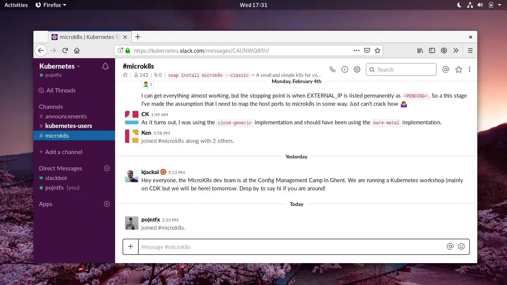

This gives the foundation a UNIXy feel but still makes it possible to refer to it as a "platform" - thus, Standard Framework should be called Cluster Platform from now on. If we focus on the services (Forum, Chat, Code etc.) as much as before discoverability suffers greatly. The Cluster Platform should be product-oriented, which makes the following categories more appropriate both on the site and also in other sectors (naming schemes are just ideas):

```plaintext
Cluster Platform/
    Landing
    Devices/
        Satellite
        Center
        Station
    Modules/
        Compute
        Communications
        Propulsion
        Rotation
        Navigation
        Energy
    Infrastructure/
        Provisioner
        Runtime
        Undercloud
        Overcloud
        Network
    Operations/
        Identity
        Workflow
        Workspace
        Activity
        Configuration
        Dashboard
        Infrastructure
        Metrics
        Demos
    Development/
        Editor
        Terminal
        Debugging
        Tracer
        Shell
    Forum (highlighted)
    Chat (highlighted)
```

Using this approach, each "Product" such as the Provisioner could have it's own channels/tags/packages/docs:

```plaintext
Infrastructure/ (#infrastructure, t/infrastructure, packages/infrastructure, docs/infrastructure)
    Provisioner (#provisioner, t/provisioner, packages/provisioner, docs/provisioner)
```

AppsCode does [exactly this](https://appscode.com/products/searchlight/):


[MicroK8s](https://microk8s.io/) also links to their code, forum and chat, all in a lightweight "multi-tenant" fashion, just like we should do it; MicroK8s even has it's own site:




It is however very important that the forum and chat are highlighted; this makes the end-user much more likely to "join the community". See the [AppsCode landing page](https://appscode.com/):


In addition to that, the chat, forum and GitLab should integrate tightly. Because the projects are managed using the site, no direct link to the GitLab organization should be provided. There must not be a "blog", but there should rather be an "Announcements" tag in the forum. From personal experience, that is how I got interested in contributing to projects (in particular, the `Communitheme` for Ubuntu, although I feel different about that nowadays).

The landing page might not be as clean as before, but it is much more usable:

```plaintext
Cluster Platform        Devices  Modules  Infrastructure  Operations  Development  [Forum]  [Chat]


                            The Futurist's Approach to System Design.


(c) 2019 Felicitas Pojtinger                                                                    Imprint
```

A simple mockup has been created to visualize this idea:


This way also makes it possible to do things such as full-fledged sub pages for each product. Even though we are referring to the whole as a "platform", the UNIXy-approach is still implemented, but it is much easier for beginners to go through the whole onboarding process.
